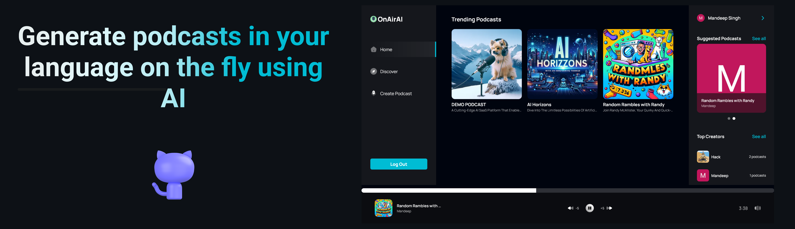
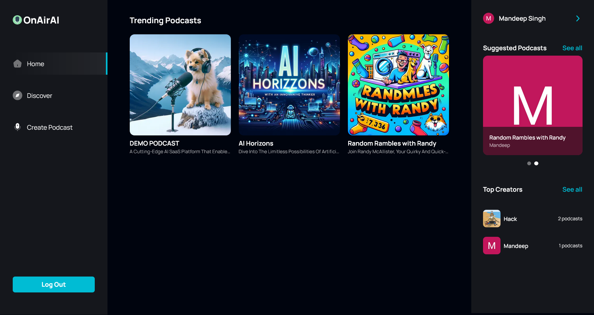
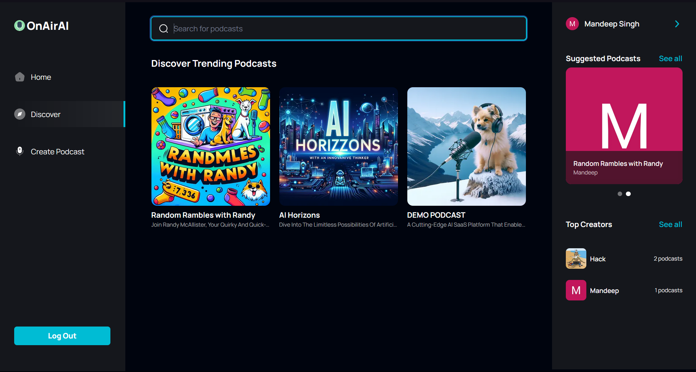
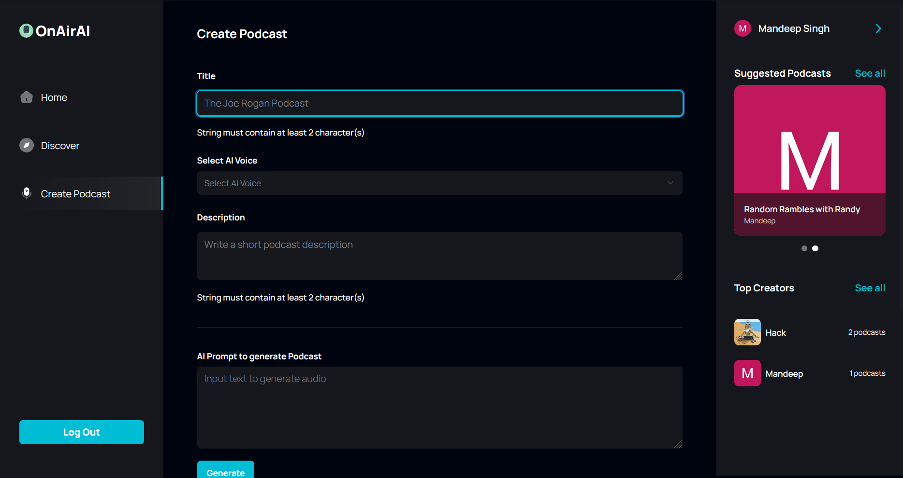
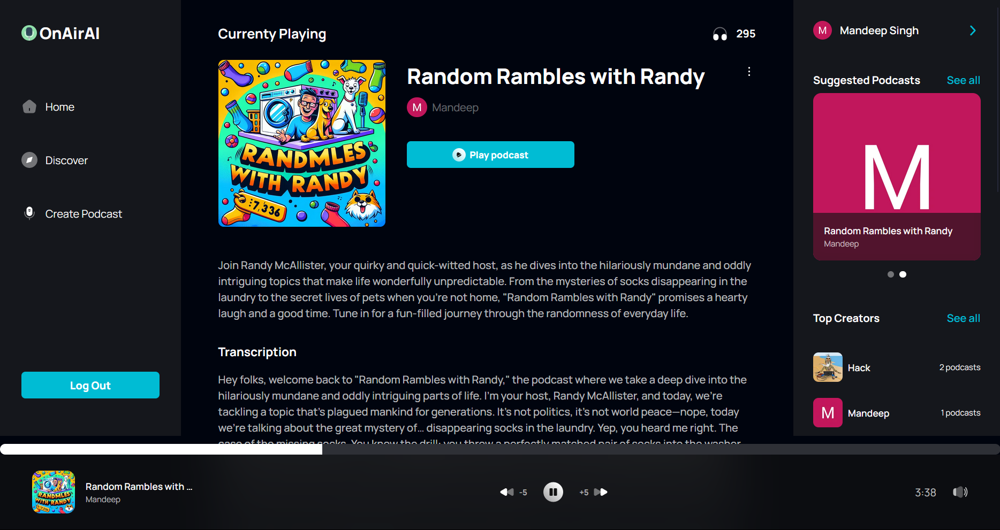
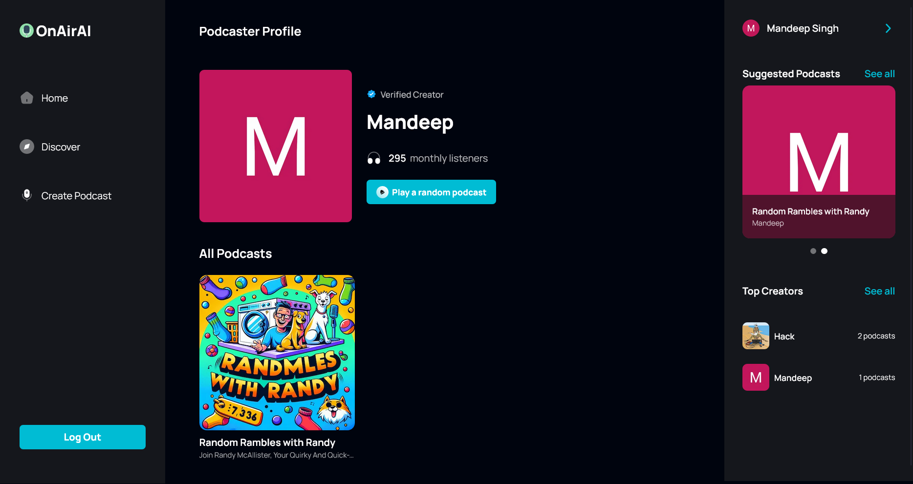

<div align="center">
  <br />
      
  <br />

  <div>
    
    
    
    
    
    
    

  </div>

  <h1 align="center">TAT Podcast Platform</h1>
  <h3 align="center">Inspired from [Yashrajgk Podcast-NextJS](https://github.com/Yashrajgk/Podcast-NextJS)</h3>

  

</div>

## 📋 <a name="table">Table of Contents</a>

1. 🤖 [Introduction](#introduction)
2. ⚙️ [Tech Stack](#tech-stack)
3. 🔋 [Features](#features)
4. 📸 [Screenshots](#screenshots)
5. 🤸 [Getting Started](#getting-started)
6. 📄 [License](#license)
7. 📞 [Contact](#contact)


## <a name="introduction">🤖 Introduction</a>

A podcast platform that enables users to create, discover, and enjoy podcasts with upload-based content creation features. The platform is built using Next.js, TypeScript, Convex, Clerk, ShadCN, and Tailwind CSS. It offers a modern home page, podcast discovery page, search functionality, podcast creation page with file upload capabilities, profile page, podcast details page, and a responsive design for a seamless user experience.

## <a name="tech-stack">⚙️ Tech Stack</a>

- Next.js
- TypeScript
- Convex
- Clerk
- ShadCN
- Tailwind CSS
- Zod (for validation)

## <a name="features">🔋 Features</a>

👉 **Advanced Authentication**: Offers secure and dependable user login and registration functionalities.

👉 **Contemporary Home Page**: Highlights trending podcasts with a persistent player for uninterrupted listening.

👉 **Podcast Discovery Page**: A dedicated section for users to explore a wide range of new and popular podcasts.

👉 **Comprehensive Search Functionality**: Empowers users to effortlessly find podcasts using various filters and criteria.

👉 **Podcast Creation Page**: Facilitates podcast creation with audio upload and thumbnail upload capabilities.

👉 **File Upload System**: Supports multiple upload methods including Convex storage and CDN upload via UploadThing.

👉 **User Profile Page**: Allows users to view and manage their created podcasts, including options to delete them.

👉 **Detailed Podcast Page**: Presents in-depth information about each podcast, including creator details, listener statistics, and transcripts.

👉 **Enhanced Podcast Player**: Includes features like rewind/fast forward controls and mute/unmute functionality for an optimal listening experience.

👉 **Responsive Design**: Ensures the platform looks great and works seamlessly on all devices and screen sizes.

and many more, including code architecture and reusability

## <a name="screenshots">📸 Screenshots</a>

<div align="center">
  
  
  
  
  
</div>

## <a name="getting-started">🤸 Getting Started</a>

Follow these steps to set up the project locally on your machine.

**Prerequisites**

Make sure you have the following installed on your machine:

- [Git](https://git-scm.com/)
- [Node.js](https://nodejs.org/en)
- [npm](https://www.npmjs.com/) (Node Package Manager)

**Cloning the Repository**

```bash
git clone https://github.com/Yashrajgk/Podcast-NextJs.git
cd Podcast-NextJs
```

**Installation**

Install the project dependencies using npm:

```bash
npm install
```

**Set Up Environment Variables**

Create a new file named `.env` in the root of your project and add the following content:

```env
CONVEX_DEPLOYMENT=
NEXT_PUBLIC_CONVEX_URL=
NEXT_PUBLIC_CLERK_PUBLISHABLE_KEY=
CLERK_SECRET_KEY=
NEXT_PUBLIC_CLERK_SIGN_IN_URL='/sign-in'
NEXT_PUBLIC_CLERK_SIGN_UP_URL='/sign-up'
```

Replace the placeholder values with your actual Convex & Clerk credentials. You can obtain these credentials by signing up on the [Convex](https://www.convex.dev/) and [Clerk](https://clerk.com/) websites.

**Running the Project**

```bash
npm run dev
```

Open [http://localhost:3000](http://localhost:3000) in your browser to view the project.


## <a name="contact">📞 Contact</a>

If you have any queries or feedback, please feel free to reach out to me at my [email](mailto:yashrajkanake2002@gmail.com) or connect with me on [LinkedIn](https://www.linkedin.com/in/yashraj-kanake/).

<br />
<br />
